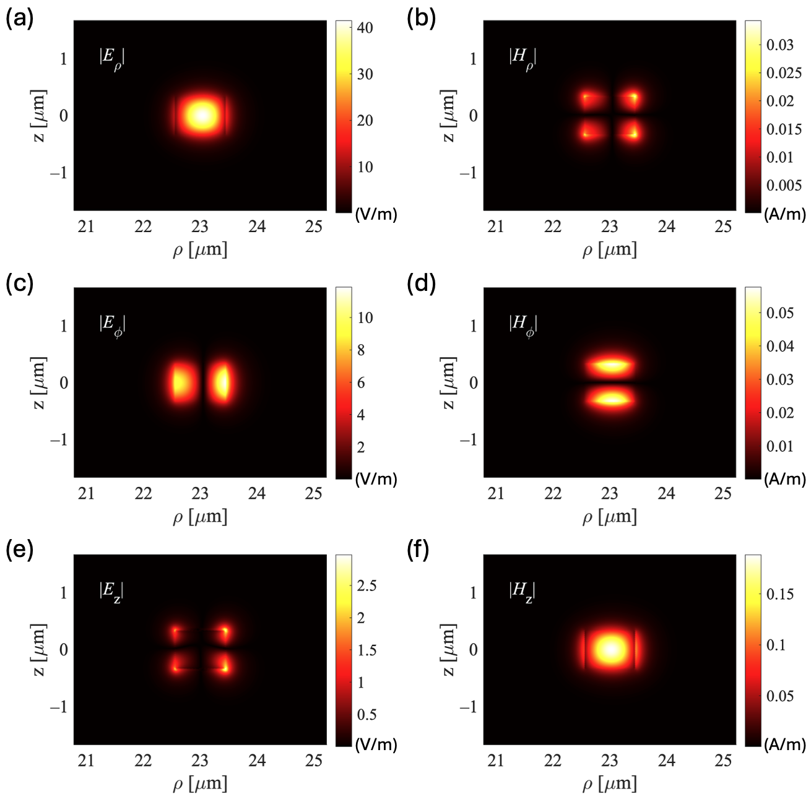
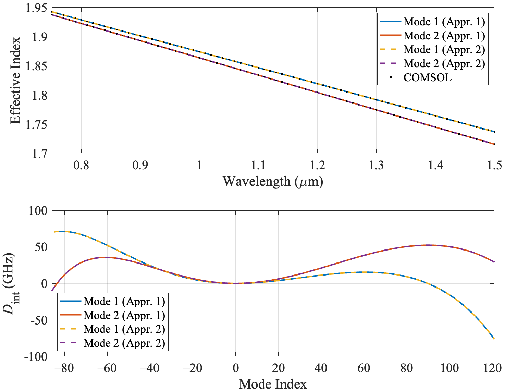

# FEM Ring Resonator Solver

MATLAB toolbox for computing whispering-gallery mode effective indices, resonances, and dispersion of axisymmetric dielectric ring resonators using a 2.5D vector finite element method (edge + nodal elements) on the meridional cross-section.

Electric and magnetic field distributions for the first resonant mode. The central radius, width, and height of the ring resonator are 23 um, 890 nm, and 670 nm, respectively. The excitation wavelength is 1.06 um.

  

(a) Effective indices vs. excitation wavelength and (b) integrated dispersions of the first two modes, assuming a pump wavelength of 1060 nm for a Si$_3$N$_4$ ring resonator surrounded by SiO$_2$. Solid and dashed curves are the outputs of approaches 1 and 2, respectively.

  

## Approaches

Two complementary strategies are provided for finding the effective index at a target wavelength:

- **Approach 1 (fixed *m*, interpolate wavelength):** Solve the generalized eigenproblem for trial integer azimuthal mode numbers `m`, bracket the target wavelength, and interpolate the effective index.
- **Approach 2 (fixed wavelength, solve for *m*):** Fix the wavelength and solve a quadratic eigenvalue problem for `m` directly (linearized into a generalized eigenproblem).

## Core solvers

| File | Description |
|---|---|
| `ring_fem_solver.m` | Solves the FEM eigenproblem for a given `m` (Approach 1 core). |
| `test_FEM_ring_neff.m` | Driver for Approach 1: computes effective index near a target wavelength by calling `ring_fem_solver.m`. |
| `ring_rcs_m_solver.m` | Solves the quadratic eigenproblem for `m` at a fixed wavelength (Approach 2 core). |
| `test_FEM_solve_m.m` | Driver for Approach 2: computes effective index at a desired wavelength by calling `ring_rcs_m_solver.m`. |
| `FEM_Ring_Solver_neff_interp.m` | Computes integrated dispersion (Approach 1) by calling `get_ring_neff.m` at multiple wavelengths and interpolating. |
| `get_ring_neff.m` | Returns the effective index at a given wavelength via interpolation. |
| `test_FEM_integrated_dispersion.m` | Driver for computing integrated dispersion using `FEM_Ring_Solver_neff_interp.m`. |

## Mesh and matrix assembly

- `generate_mesh.m` — generates the triangular mesh of the meridional cross-section.
- `build_edges.m` — builds the edge connectivity for Nédélec edge elements.
- `elem_matrices.m` / `elem_matrices_split.m` — assemble element stiffness/mass matrices.
- `gauss7.m` — 7-point Gaussian quadrature rule for element integration.
- `get_refractive_index.m` — material refractive index / permittivity lookup.

## Field reconstruction and post-processing

- `compute_Hfield.m` — reconstructs the magnetic field from the computed electric field.
- `reconstruct.m` — reconstructs full-domain fields from element degrees of freedom.
- `analyze_dispersion.m` — computes/analyzes dispersion from effective index data.

## Plotting

- `plot_mesh.m` — plots the finite element mesh.
- `plot_mode.m` — plots a computed mode profile.
- `plot_Emode.m` — plots the electric field mode profile.
- `plot_Hmode.m` — plots the magnetic field mode profile.

## Requirements

MATLAB (tested with standard sparse eigensolver `eigs`, no additional toolboxes required beyond base MATLAB).

## Usage

Run `test_FEM_ring_neff.m` or `test_FEM_solve_m.m` to compute the effective index at a target wavelength using Approach 1 or 2, respectively. Run `test_FEM_integrated_dispersion.m` to compute integrated dispersion across a wavelength range.
